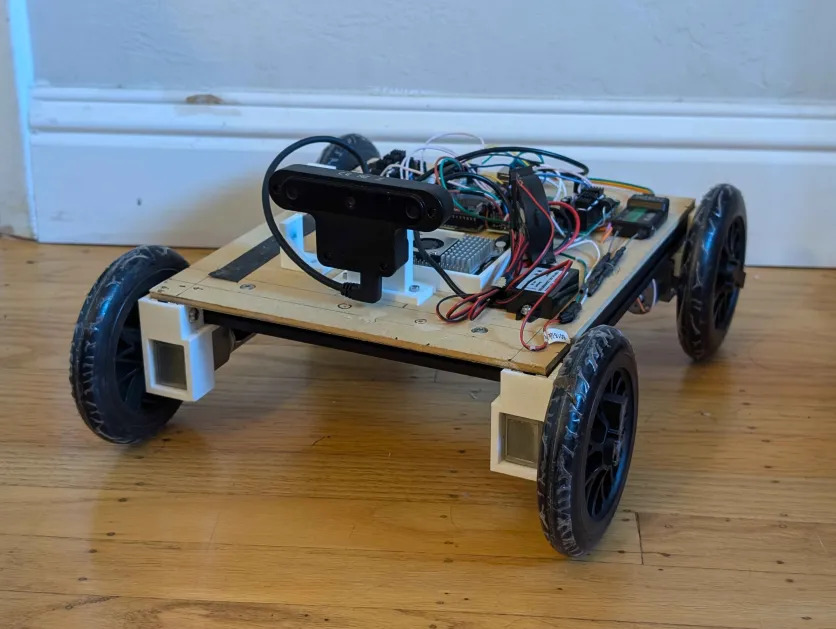

# Autocar

Self driving robot car.

[Paper](assets/paper.pdf)



<div align="center">
    <video src="https://github.com/phuang1024/Autocar/raw/master/assets/video.mp4" width="100%" />
</div>

The car automatically drives and avoids obstacles.

## Software

### Get data:

Drive via RC to gather data.
Enable switch 2 (channel 6) to start recording.

```bash
python main.py data --dir data/
```

### Train model:

```bash
python main.py train --data data/ --results results/
```

### Inference

Control via RC is still required, and mixed with NN control.

```bash
python main.py auto --model-path model.pt
```

### ONNX

Inference on DepthAI OAK-D.

```bash
python export.py model.pt model.onnx
./blobconv.sh model.onnx output_dir/

python main.py auto --model-path output_dir/model.blob
```

## Firmware

Arduino firmware.

Sends PWM signal to motor drivers.

Reads iBus receiver data via `IBusBM` package.

Sends iBus data and receives motor data via serial.

Upload `firmware.ino` to Arduino.

## RC controls

Tank steer: Left and right up/down control respective motor direction and power.

Standard steer: Left up/down is power. Right left/right is direction.

Switch 1: Enable/disable motors.

Switch 2: Start/stop other application, e.g. data recording, NN inference, etc.
